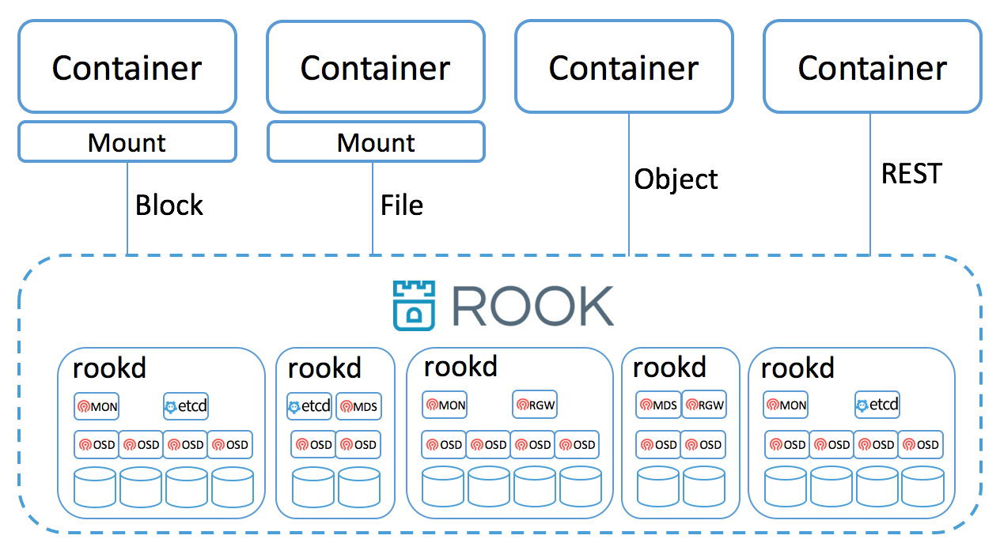

## Open, Cloud Native, and Universal Distributed Storage

- [What is Rook?](#what-is-rook)
- [Status](#status)
- [Quickstart](#quickstart)
- [Design](#design)
- [Contributing](#contributing)
- [Contact](#contact)
- [Licensing](#licensing)

## What is Rook?

Rook is a distributed storage system designed for cloud native applications. It
exposes file, block, and object storage ontop of shared resource pools. Rook has minimal
dependencies and can be deployed in dedicated storage clusters or converged clusters. It's
self-managing, self-protecting, self-healing, and is designed to just work without teams of
engineers managing it. It scales from a single node, to multi-PB clusters spread geographically.
It's based on the Ceph project with over 10 years of production deployments in some of the
largest storage clusters in the world.

## Status

Rook is in **alpha** state. Not all planned feature are complete. The API and other user-facing
objects are subject to change. Backward-compability is not supported for this release. See our
[Roadmap](https://github.com/rook/rook/wiki/Roadmap) and [Issues](https://github.com/rook/rook/issues).
Please help us by [Contributing](CONTRIBUTING.md) to the project.

## Quickstart

1. Install Rook
2. Run the Rook daemon
3. Create a volumes
4. Mount and use the volume

## Design

A rook cluster is made up of one or more nodes each running the Rook daemon `rookd`. Containers and Pods can
mount block devices and filesystems exposed by the cluster, or can use S3/Swift API for object storage. There is
also a REST API exposed by `rookd` as well as a command line tool called `rook`.

The Rook daemon `rookd` is a single binary that is self-contained and has all that is needed to bootstrap, scale
and manage a storage cluster. `rookd` is typically compiled into a single static binary (just like most golang
binaries) or a dynamic binary that takes a depndency on mostly libc. It can run in minimal containers, along side a
hypervisor, or directly on the host on most Linux distributions.

`rookd` uses an embedded version of Ceph for storing all data -- there are no changes to the data path. An embedded version
of Ceph was created specifically for Rook scenarios and has been pushed upstream. Rook does attempt to maintain full fidelity
with Ceph, for example, most of the Ceph concepts like OSDs, MONs, placement groups, etc. are hiddent. Instead Rook creates
a much simplified UX for admins that is in terms of physical resources, pools, volumes, filesystems, and buckets.

`rookd` embeds Etcd within the cluster store configuration, and coordinate cluster-wide management operations. `rookd` will automatically
bootstrap Etcd, manage it, and scale it as the cluster grows. Its also possible to use an external Etcd instead of the embedded one
if needed.

Rook and etcd are implementd in golang. Ceph is implemented in C++ where the data is highly optimized. We believe
the combination offers the best of both worlds.

See [Design](https://github.com/rook/rook/wiki/Design) wiki for more details.

## Contributing

We welcome contributions. See [Contributing](CONTRIBUTING.md) to get started.

## Report a Bug

For filing bugs, suggesting improvements, or requesting new features, help us out by opening an [issue](https://github.com/rook/rook/issues).

## Contact

The project currently uses the general CoreOS email list and IRC channel:
- Email: [rook-dev](https://groups.google.com/forum/#!forum/rook-dev)
- Gitter: [rook-dev](https://gitter.im/rook/rook-dev)

## Licensing

Rook is under the Apache 2.0 license.
